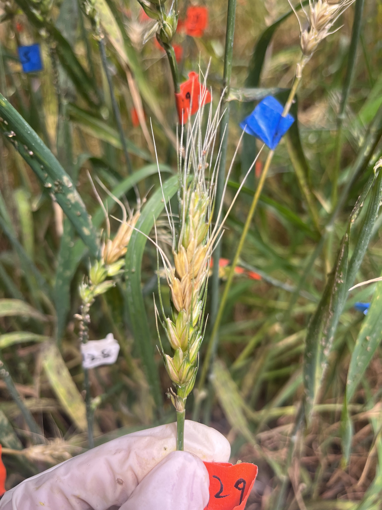

# Wheat-FHB-DSR-Measurement

This repository contains the code and dataset for the study "A multi-scale-aware detection algorithm for automated measurement of diseased spikelet rate of wheat Fusarium Head Blight".

## Overview

- [Dataset](#dataset)
- [Environment Setup](#environment-setup)

## Dataset
The dataset comprises 620 high-resolution spike images infect with FHB. These images were acquired using RGB camera of smartphone at greenhouse conditions, which provided high-contrast and detailed images of the FHB-infected wheat spike. Detailed spikelet-level annotations were created for these spikes. 
<table>
  <tr>
    <td></td>
    <td></td>
    <td></td>
  </tr>
</table>

If you need the complete dataset, please download the [Wheat-FHB-DSR-Measurement Dataset User Agreement](./Wheat-FHB-DSR-Measurement Dataset User Agreement.docx) and read the relevant regulations. If you agree to the regulations, please fill in the relevant user information in the user agreement, [authorization date], and [electronic signature] at the end of the agreement. Send the PDF format of the user agreement to the email **[liuweizhen@whut.edu.cn](mailto:liuweizhen@whut.edu.cn)**. After review, we will send the download link for the complete dataset via email.

## Environment Setup
* Python 3.6/3.7/3.8
* Pytorch 1.10 or above
* pycocotools (Linux: `pip install pycocotools`; Windows: `pip install pycocotools-windows` (no need to install VS separately))
* Ubuntu or CentOS (Windows not recommended)
* Preferably use GPU for training
* For detailed environment setup, refer to `requirements.txt`
